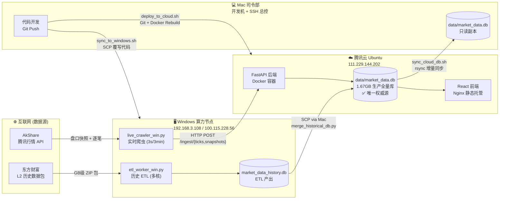
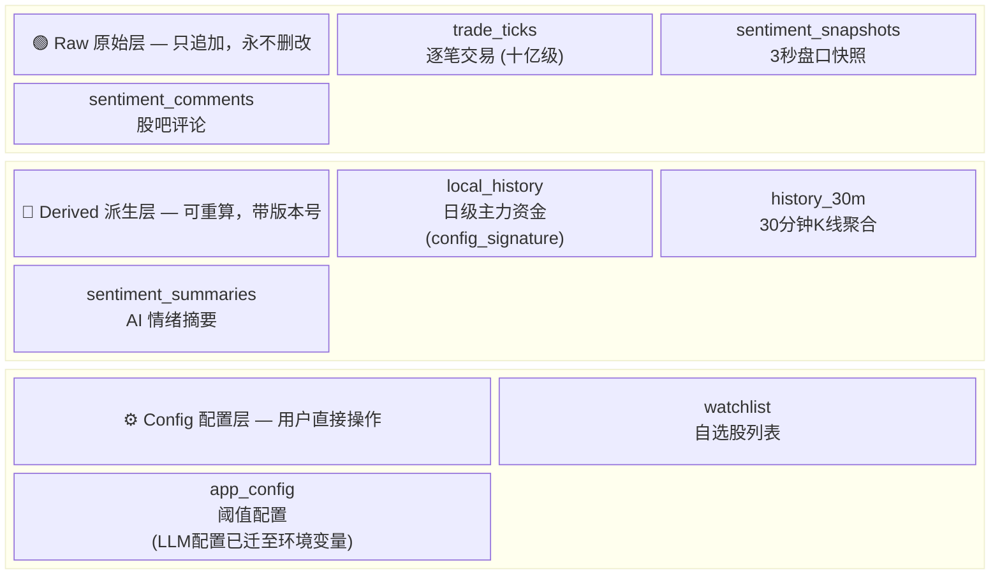
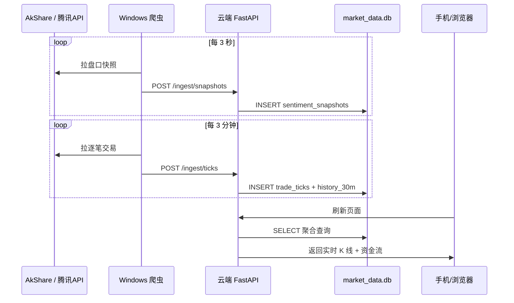
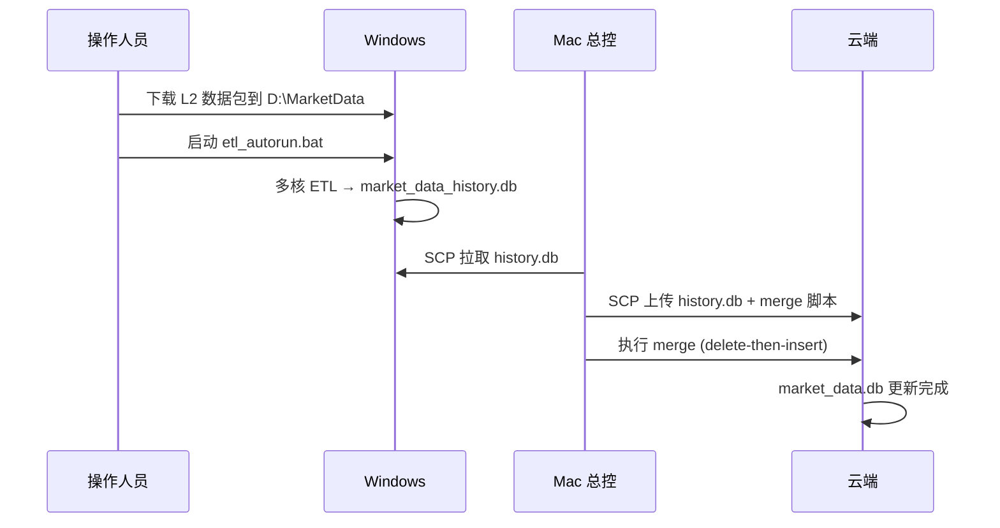

# ZhangData 系统架构与数据流全景图

> 📖 这份文档面向**人类读者**，用可视化方式展示系统的物理拓扑和数据流向。  
> AI 开发请查阅 `docs/01_SYSTEM_ARCHITECTURE.md`（严格规则版）和 `docs/03_DATA_CONTRACTS.md`（表结构契约版）。

---

## 🗺️ 物理拓扑

---

## 📊 数据库三层结构

---

## 🔄 两条数据流水线

### 流水线 A：盘中实时流（每个交易日 9:15 ~ 15:05）

### 流水线 B：历史离线 ETL（不定期批处理）

---

## 🔑 关键脚本速查

| 脚本 | 在哪运行 | 做什么 |
|------|---------|--------|
| `live_crawler_win.py` | Windows | 盘中实时抓取，POST 到云端 |
| `etl_worker_win.py` | Windows | L2 历史数据 ETL，产出 history.db |
| `etl_autorun.bat` | Windows | ETL 自动重试运行容器 |
| `merge_historical_db.py` | 云端 | 将 history.db 合并到生产库 |
| `sync_cloud_db.sh` | Mac | rsync 增量同步云端生产库到本地 |
| `sync_to_windows.sh` | Mac | 将代码 SCP 到 Windows |
| `deploy_to_cloud.sh` | Mac | Git pull + Docker 重建部署 |

---

## ⚠️ 三条致命红线

1. **云端不能外网抓数据** — IP 已被东财永久封禁，只能被动接收 Windows 喂的数据
2. **Windows 不跑 Git** — 代码靠 Mac `sync_to_windows.sh` 覆写，不要在 Win 上 pull/push
3. **Mac 不长期跑爬虫** — 仅用于开发和 SSH 总控，数据全靠 `sync_cloud_db.sh` 从云端拉

---

## 🔐 安全配置

| 文件 | 用途 | 注意事项 |
|------|------|----------|
| `deploy/.env` | 云端 LLM Key | 手动创建，不入 Git |
| `.env.local` | 本地开发 Key | `.gitignore` + `.cursorignore` 双重屏蔽 |
| `.cursorignore` | AI 工具屏蔽 | 阻止 Cursor 等扫描敏感文件 |

> 详细 Key 维护指南见 `docs/05_LLM_KEY_SECURITY.md`

---

*最后更新：2026-03-06*
