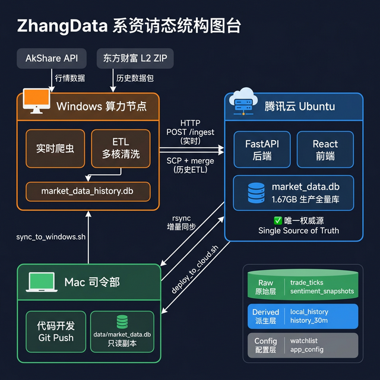
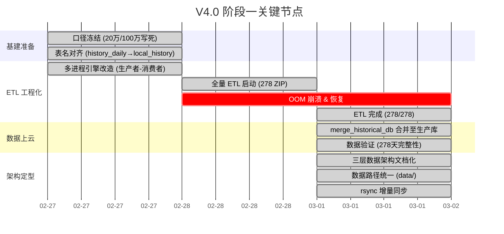

# V4.0 阶段一复盘：历史数据 ETL 与数据架构定型

> **时间跨度**：2026-02-27 ~ 2026-03-01（5 天）  
> **核心目标**：打通 A 股全市场 1 年期 L2 历史数据从离线清洗到云端上线的完整闭环，并同步定型三节点数据架构。

---

## 一、系统拓扑总览

> 上图完整呈现了 ZhangData 三节点物理架构的最终定型形态。数据从外部 API 和 L2 数据包出发，经 Windows 节点清洗，汇聚至云端权威库，再由 Mac 开发机通过 rsync 增量同步获取只读副本。

---

## 二、里程碑时间线

---

## 三、关键成果

### 3.1 数据成果

| 指标 | 数值 |
|------|------|
| 处理的 ZIP 数据包 | **278 个**（全市场日级 L2） |
| 每个 ZIP 包含的 CSV | ~5000 个（全 A 股） |
| 最终生产库大小 | **1.67 GB** (`data/market_data.db`) |
| 历史天数覆盖 | **278 个交易日**（约 1 年） |
| `local_history` 记录数 | ~百万条（全市场 × 278 天） |
| `history_30m` 记录数 | ~千万条（全市场 × 278 天 × 8 个 30min 窗口） |

### 3.2 工程成果

| 成果 | 说明 |
|------|------|
| **多进程 ETL 引擎** | 生产者-消费者模式，4 workers 并行处理，Manifest 断点续传 |
| **实时爬虫稳定运行** | `live_crawler_win.py` 3 秒/3 分钟双频，Windows→云端 HTTP POST 管线 |
| **数据路径统一** | `config.py`、Docker Compose、`sync_cloud_db.sh` 全部归一到 `data/` 目录 |
| **三层数据架构** | Raw / Derived / Config 分层文档化，写入规则明确 |
| **rsync 增量同步** | `sync_cloud_db.sh` 从 SCP 升级为 rsync，后续同步从 45 分钟→几十秒 |
| **四大核心文档定型** | 01 架构 / 02 业务 / 03 契约 / 04 运维 规范稳定 |

---

## 四、踩坑复盘

### 🐛 坑 1：OOM 静默崩溃 — 无日志可查

- **根因**：4 workers × 每个 ZIP 含 5000 CSV → 内存峰值超 Windows 物理内存，被 OS 直接 SIGKILL
- **表现**：Python 进程消失，无 Exception、无 traceback。schtasks 退出码 `267014`
- **修复**：限制 workers 数量 ≤ `(可用内存GB - 2) / 1.5`
- **教训**：**Workers 宁少勿多，OOM 无日志、无回滚**

### 🐛 坑 2：PID Lock 死锁导致无法自动恢复

- **根因**：BAT 的 `taskkill /F /IM python.exe` 杀死所有 Python 进程，PID Lock 指向已死进程
- **修复**：去掉 `taskkill`，改为 PID Lock 自治 + 20 次重试循环（间隔 30s）
- **教训**：**让 Lock 机制自管理，不要粗暴 kill 全局进程**

### 🐛 坑 3：进度监控延迟 — check_etl.sh 假象

- **根因**：manifest `DONE` 状态在 ZIP 完全处理完并 commit 后才更新，大 ZIP 处理 2-5 分钟
- **教训**：**manifest 进度可能比实际完成少 1-4 个，不要跳过 PID 存活检查就以为挂了**

### 🐛 坑 4：表名错位 — `history_daily` vs `local_history`

- **根因**：ETL 产出表默认叫 `history_daily`，但云端 `merge_historical_db.py` 和前端 API 都查 `local_history`
- **修复**：在 `etl_worker_win.py` 中硬拉对齐到 `local_history` 并重刷
- **教训**：**新增表/改表名前必须查 `03_DATA_CONTRACTS.md` 契约**

### 🐛 坑 5：本地数据漂移 — 开发用空库

- **根因**：`config.py` 默认路径在项目根目录 `market_data.db`，但 Docker 挂载路径在 `data/`，本地开发看到的是另一个空库
- **修复**：统一所有路径到 `data/market_data.db`，`sync_cloud_db.sh` 下载到 `data/`
- **教训**：**路径不对等于数据不存在——本地、Docker、云端三处路径必须一致**

---

## 五、架构演进总结

### 5.1 本阶段的关键架构决策

| 决策 | 变更前 | 变更后 | 原因 |
|------|--------|--------|------|
| 阈值口径 | 前端可动态配置 | **写死 20万/100万** | 改一个数字就要重刷几十小时 ETL，不可接受 |
| ETL 表名 | `history_daily` | **`local_history`** | 与前端 API、merge 脚本契约对齐 |
| DB 路径 | 项目根目录 | **`data/market_data.db`** | 与 Docker 挂载路径一致，消除本地/云端漂移 |
| 同步方式 | SCP 全量（~45min） | **rsync 增量（~30s）** | 首次拉完后只传差异块 |
| 数据分层 | 无规范 | **Raw / Derived / Config 三层** | 明确写入规则，防止误删原始数据 |

### 5.2 数据库三层架构定型

| 层级 | 表 | 写入规则 |
|------|-----|---------|
| 🟢 **Raw 原始层** | `trade_ticks`, `sentiment_snapshots`, `sentiment_comments` | 只追加，永不 UPDATE/DELETE |
| 🔵 **Derived 派生层** | `local_history`, `history_30m`, `sentiment_summaries` | 带 `config_signature`，可重算可覆写 |
| ⚙️ **Config 配置层** | `watchlist`, `app_config` | 用户直接操作 |

---

## 六、Lessons Learned（经验教训）

### ✅ 做对了的事

1. **Manifest 断点续传**：无论崩溃多少次，已完成的 ZIP 永远不会被重复处理——这是最关键的安全网
2. **样本→全量的渐进策略**：先用 5 只股票 POC，再全量，避免了方向性错误
3. **操作手册先行**：中途就写了 `ETL_POSTMORTEM.md`，后续恢复时直接照着操作
4. **数据契约文档化**：三层分类让所有 AI/人类协作者对"能不能删"有清晰判断

### ❌ 下次要改进的事

1. **OOM 保护机制**：应该在 ETL 脚本中加入内存水位监控，超过 80% 主动暂停 worker
2. **进度上报粒度**：manifest 应该增加"处理中"状态，而不仅是 PENDING/DONE 二态
3. **自动化告警**：崩溃后应有通知机制（Webhook/邮件），而不是人工 SSH 巡检
4. **CI 前置检查**：在 `sync_to_windows.sh` 之前应自动跑 pylint/mypy，避免推送有语法错误的代码到 Windows

---

## 七、下一阶段展望

阶段一（底层基建与口径冻结）已 **全部完成** ✅。接下来进入 V4.0 的核心产品阶段：

### 阶段二：大一统数据网关与单页重构

| 工作项 | 说明 |
|--------|------|
| 统一 `/api/timeseries` API | 入参 `start, end, granularity`，后端智能判断查实时内存还是 SQLite 历史 |
| 前端单页时间轴重构 | 废除实时/历史双页，引入顶部时间拖拽轴（DataZoom） |
| 数据对齐保证 | `fund_flow_series`, `sentiment_series` 长度和时间戳绝对对齐 |

> 详见 [V4.0 Roadmap](V4.0_ROADMAP.md) 阶段二规划。

---

*最后更新：2026-03-01*  
*关联文档：[ETL 过程复盘](ETL_POSTMORTEM.md) · [系统架构](01_SYSTEM_ARCHITECTURE.md) · [数据契约](03_DATA_CONTRACTS.md) · [V4.0 Roadmap](V4.0_ROADMAP.md)*
